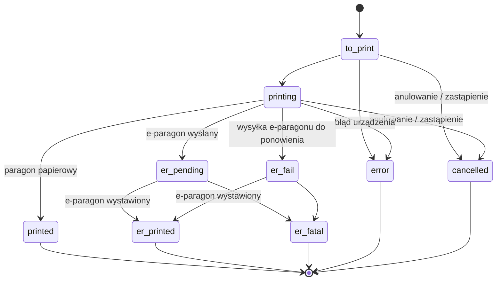

# Model domeny

Integrator pracuje z trzema obiektami: zleceniem fiskalizacji, drukarką i powstałym
z nich e-paragonem (znaczenie pojęć: [słownik](01-wprowadzenie.md#słownik)).

## Zlecenie fiskalizacji

### Pola dokumentu (element tablicy `print_requests[]` w zleceniu)

| Pole | Wymagane | Opis |
|------|----------|------|
| `external_id` | **tak** | identyfikator dokumentu **w Twoim systemie** (string); chroni przed podwójną fiskalizacją — patrz [unikalność](#unikalnosc). Wraca w webhookach. |
| `mode` | nie | tryb: `print` (paragon papierowy) albo `e_receipt` (e-paragon). Domyślnie brany z drukarki, lub `print`. Zapisy `e-receipt`/`ereceipt` też są akceptowane. |
| `vendor` | tak | identyfikator Twojego systemu — [opis](04-endpointy.md#tworzenie-zlecenia) |
| `printer_id` | zalecane | `id` drukarki z `GET /printers.json` (zamiennik: `printer_name` — dopasowanie po nazwie). Bez obu → drukarka domyślna konta, a gdy brak → pierwsza. |
| `kind` | nie | typ dokumentu: `receipt` (paragon, domyślny) albo `vat` (faktura drukowana na drukarce fiskalnej). **E-paragon wymaga `kind=receipt`.** Rabaty (`discount`/`discount_percent`) działają dla obu — na fakturze zachowanie zależy od drukarki klienta, patrz [rabat na fakturze](#rabat-na-fakturze). Dla `kind=vat` część protokołów drukarek wymaga `buyer.tax_no` ([błąd NIP](06-bledy.md)). |
| `system_number` | nie | numer dokumentu (drukowany; obcinany do 15 znaków). |
| `order_number` | nie | dodatkowy identyfikator zamówienia (do wyszukiwania w Paragony.pl). |
| `external_url` | nie | link do dokumentu w Twoim systemie (widoczny przy zleceniu w Paragony.pl). |
| `currency` | nie | **tylko `PLN`** (domyślne). Inna waluta = odrzucenie dokumentu. |
| `price_gross` | nie | suma brutto dokumentu; gdy brak — wyliczana z pozycji. Musi być dodatnia i **zgodna z sumą pozycji** (patrz walidacje). |
| `payment_to` | nie | termin płatności (do 16 znaków) — **drukowany tylko dla `kind=vat`**. |
| `payment_type` / `payment_type_text` | nie | forma płatności do wydruku (do 20 znaków) — patrz [forma płatności](#forma-platnosci). |
| `buyer` | nie | obiekt nabywcy: `name`, `email`, `address`, `tax_no`. `email` służy **wyłącznie doręczeniu e-paragonu mailem** — nie jest drukowany, nie wchodzi do treści e-paragonu i nie jest wymagany do fiskalizacji; jego podanie włącza automatyczną wysyłkę ([E-paragon](#e-paragon)). `tax_no` drukowany na paragonie jako NIP nabywcy (paragon z NIP). `name` i `address` — **drukowane tylko dla `kind=vat`**. |
| `positions` | **tak** | tablica pozycji (niżej). Pusta tablica = odrzucenie dokumentu. |
| `recipient_name` | nie | odbiorca (do 26 znaków) — **drukowany tylko dla `kind=vat`**. |

Pola wspólne dla całego żądania (obok tablicy `print_requests`):

| Pole | Opis |
|------|------|
| `vendor` | **wymagany** (dla całego żądania lub per dokument) — identyfikator Twojego systemu; [role i semantyka](04-endpointy.md#tworzenie-zlecenia) |
| `ptu_letter_in_names` | `true` → do nazwy każdej pozycji na wydruku doklejana jest litera stawki VAT (np. „ A”). |

### Forma płatności

`payment_type` to kod formy płatności, `payment_type_text` — etykieta drukowana na
paragonie (obcinana do 20 znaków).

Rozpoznawane kody: `cash`, `card`, `cheque`, `bon`, `credit`, `transfer`, `voucher`,
`other` — dopuszczalny jest też dowolny własny kod, a dopasowanie jest czułe na wielkość
liter (`CARD` jest kodem własnym). Bez `payment_type_text` etykietę wyznacza kod: dla
rozpoznanego kanoniczna nazwa (GOTÓWKA/KARTA/CZEK/BON/KREDYT/PRZELEW/VOUCHER/INNA),
dla własnego — sam kod. Sama etykieta, bez `payment_type`, jest drukowana jako forma INNA.

Poza tym zachowanie zależy od drukarki klienta, a integrator jej nie wybiera:

- przy kodzie rozpoznanym część urządzeń drukuje `payment_type_text` bez zmian, a część
  zastępuje je nazwą kanoniczną;
- bez obu pól część urządzeń pomija formę płatności, a część zapisuje gotówkę.

Własną nazwę formy płatności prześlij jako własny kod w `payment_type` — ta ścieżka daje
ten sam wydruk na każdym urządzeniu.

### Pozycje (`positions[]`)

| Pole | Wymagane | Opis |
|------|----------|------|
| `name` | **tak** | nazwa pozycji (drukowana; obcinana do 40 znaków/linia). |
| `short_name` | nie | krótsza nazwa — jeśli podana, drukowana zamiast `name`. |
| `quantity` | **tak** | ilość — większa od zera, dopuszczalna ułamkowa, maksymalnie 5 miejsc po przecinku ([błąd](06-bledy.md)). |
| `price_gross` | **tak** | cena jednostkowa brutto. |
| `total_price_gross` | **tak** | wartość brutto pozycji. Musi być **dodatnia** i równa `price_gross × quantity` (zaokrąglenie do 2 miejsc). |
| `tax` | **tak** | stawka VAT — patrz [mapowanie stawek](#stawki-vat). |
| `discount` | nie | kwota rabatu (brutto) na pozycji. Podana ma pierwszeństwo przed `discount_percent` — gdy oba pola podane, `discount_percent` staje się wyłącznie opisem drukowanym, a kwotę rabatu wyznacza `discount`. Na fakturze zachowanie zależy od drukarki klienta — patrz [rabat na fakturze](#rabat-na-fakturze). |
| `discount_percent` | nie | procent rabatu (0–100 wyłącznie), drukowany na paragonie. Bez `discount` kwotę wylicza API: `kwota = total_price_gross − zaokrąglone(price_gross × (1 − procent/100) × quantity, 2)` (połówki w górę) — [przykład liczbowy](04-endpointy.md#przyklad-pelny). |
| `service` | nie | `true` = pozycja jest usługą (ma znaczenie dla stawki `disabled` — patrz niżej). |

### Rabat na fakturze (`kind=vat`)

Na paragonie rabat zawsze drukuje się jako osobna pozycja. Na fakturze zależy to od
drukarki klienta, a integrator jej nie wybiera:

- część urządzeń obsługuje osobną linię rabatu — rabat odejmuje drukarka, dokument
  drukuje się normalnie;
- pozostałe wymagają wliczenia rabatu w ceny pozycji. Jeśli rabatu nie da się wyrazić
  ceną jednostkową co do grosza (typowo przy `quantity` > 1), zlecenie jest odrzucane
  **przy wydruku** ([komunikat](06-bledy.md)) — prześlij wtedy `price_gross` i
  `total_price_gross` już po rabacie, bez pól `discount`/`discount_percent`.

### Walidacje zlecenia (po stronie Paragony.pl, przed wysyłką do drukarki)

- `positions` niepuste; `total_price_gross` i `price_gross` każdej pozycji > 0;
- `quantity` każdej pozycji > 0 i maksymalnie 5 miejsc po przecinku;
- `total_price_gross == price_gross × quantity` (na 2 miejsca) — inaczej
  „Niepoprawna wartość brutto na pozycji N”;
- suma `total_price_gross − discount` po pozycjach musi się równać `price_gross`
  dokumentu — inaczej „Niepoprawna wartość brutto na dokumencie”;
- `currency == "PLN"`; suma dokumentu dodatnia;
- rozpoznawalna stawka VAT każdej pozycji (niżej);
- dla `mode=e_receipt`: `kind == "receipt"` (`buyer.email` jest opcjonalny — bez niego
  e-paragon powstaje normalnie, tylko nie idzie mailem);
- dla `mode=e_receipt`: drukarka musi **obsługiwać** e-paragony i mieć **skonfigurowane**
  e-paragony (pola `e_receipt` i `e_receipt_configured` drukarki) — inaczej zlecenie
  jest **przyjmowane od razu ze statusem `error`** (dokument nie zostanie zafiskalizowany;
  status widzisz w elemencie odpowiedzi tworzenia);
- aktywna subskrypcja e-paragonów z dostępnym limitem (patrz [błędy rozliczeń](06-bledy.md#rozliczenia)).

Dokumenty w jednym zleceniu walidowane są **niezależnie** — część może przejść, część
zostać odrzucona; werdykt per dokument niesie odpowiedź tworzenia
([kontrakt pozycyjny](04-endpointy.md#tworzenie-zlecenia)).

### Walidacje po stronie drukarki

Nawet poprawnie przyjęte zlecenie może zakończyć się błędem na urządzeniu (np. brak papieru,
błąd protokołu, odrzucenie przez moduł fiskalny). Taki wynik wraca jako status `error`
(lub `er_fatal` dla nieudanej wysyłki e-paragonu po fiskalizacji) wraz z tekstowym opisem
z urządzenia — traktuj go jako komunikat diagnostyczny do pokazania użytkownikowi,
jego treść zależy od modelu drukarki.

### Stawki VAT

Pole `tax` pozycji jest mapowane na literę stawki (PTU) drukarki fiskalnej:

| `tax` | litera PTU |
|-------|------------|
| `23` | A |
| `8` | B |
| `5` | C |
| `0` | D |
| `zw` (zwolniony) | E |
| `disabled` | litera **Zera technicznego** z ustawień konta (osobna dla towaru i usługi — pole `service`); **wymaga wcześniejszej konfiguracji** Zera technicznego w Ustawieniach na stronie Paragony.pl, inaczej błąd |

Wartości można podawać jako liczby lub stringi (`23`, `"23"`, `"23.0"` działają tak samo).
Nierozpoznana stawka = odrzucenie dokumentu („Niepoprawna stawka VAT”).

### Statusy zlecenia (cykl życia)

| Status | Faza | Znaczenie |
|--------|------|-----------|
| `to_print` | oczekujący | w kolejce, czeka na pobranie przez drukarkę |
| `printing` | oczekujący | pobrane przez drukarkę, w trakcie wydruku/fiskalizacji |
| `printed` | **końcowy** | zafiskalizowany **paragon papierowy** |
| `er_pending` | przejściowy | fiskalizacja e-paragonu wykonana, e-paragon w drodze — czekamy na potwierdzenie wystawienia |
| `er_fail` | przejściowy | dokument zafiskalizowany, wysyłka e-paragonu chwilowo nieudana — urządzenie ponawia |
| `er_printed` | **końcowy** | e-paragon wystawiony; w webhooku przychodzi `view_url` |
| `er_fatal` | **końcowy** | dokument zafiskalizowany, ale e-paragon ostatecznie nie powstał |
| `error` | **końcowy** | zlecenie zakończone błędem — dokument nie został zafiskalizowany |
| `cancelled` | **końcowy** | zlecenie anulowane (żądaniem `DELETE` albo zastąpione nowym zleceniem na ten sam `external_id`) |

Gwarancje:

- **`er_printed` jest ostateczny** — raz osiągnięty nigdy się nie zmienia.
- Zlecenie zafiskalizowane (`printed`, `er_*`) **nigdy nie wraca** do stanów oczekujących
  ani do `error`/`cancelled`.
- `er_pending` i `er_fail` to stany przejściowe — rozstrzygną się w `er_printed` albo
  `er_fatal`. Dokument jest już wtedy zafiskalizowany; różnica dotyczy tylko dostarczenia
  e-paragonu.
- W kodzie klienta porównuj status ze zbiorem, nie z jedną wartością: końcowe to
  `printed`, `er_printed`, `er_fatal`, `error`, `cancelled`, a zafiskalizowane —
  `printed` lub `er_printed`.

### Unikalność / ochrona przed podwójną fiskalizacją

Dla jednej pary (`vendor`, `external_id`) może istnieć **najwyżej jedno aktywne zlecenie**
(o statusie innym niż `error`/`cancelled`). Unikalność liczy się **w ramach Twojego konta,
per vendor** —
ten sam `external_id` pod dwoma różnymi vendorami to dwa niezależne zlecenia. Ponowne zlecenie
z tym samym `external_id` (i tym samym vendorem):

- gdy istniejące jest **oczekujące** (`to_print`/`printing`) → stare zostaje **anulowane**
  (`cancelled`), nowe je zastępuje — bezpieczny sposób na „popraw i wyślij jeszcze raz”;
- gdy istniejące jest **zafiskalizowane** (`printed`, `er_*`) → nowe zostaje **odrzucone**
  („Paragon jest już zafiskalizowany — nie drukujemy ponownie”). Dzięki temu nie da się
  przypadkiem zafiskalizować dokumentu drugi raz;
- zlecenia zakończone jako `error`/`cancelled` nie blokują — można zlecić ponownie.

## Drukarka

| Pole | Opis |
|------|------|
| `id` | identyfikator drukarki — tę wartość podajesz w `print_requests[].printer_id` |
| `uid` | identyfikator (UID) drukarki |
| `name` | nazwa widoczna w Paragony.pl; może służyć do wskazania drukarki (`printer_name`) |
| `model` | model urządzenia |
| `connection_method` | sposób połączenia (np. `usb`, `tcp`) |
| `default_mode` | domyślny tryb wydruku (`print`/`e_receipt`) — używany, gdy zlecenie nie podaje `mode` |
| `e_receipt` | czy urządzenie **obsługuje** e-paragony |
| `e_receipt_configured` | czy e-paragony są na urządzeniu **skonfigurowane** |
| `footer_text` | dodatkowy tekst stopki wydruku |
| `deleted` | `true` = drukarka usunięta; usunięcie sygnalizuje też webhook `printer:destroy` |

Drukarki rejestruje aplikacja Paragony.pl zainstalowana przy urządzeniu — integrator
tylko je listuje i wskazuje w zleceniach.
Pola opisowe (`name`, `footer_text`, `default_mode`, `logo_data`) zaktualizujesz przez
[`PATCH /printers/:id.json`](04-endpointy.md#drukarki); pozostałe są tylko do odczytu.

Zmiany drukarek (dodanie, edycja, usunięcie) są rozgłaszane webhookami
`printer:create|update|destroy` — patrz [Webhooki](05-webhooki.md).

## E-paragon

Powstaje po udanej fiskalizacji w trybie `e_receipt`. Dla integratora najważniejszy jest
**`view_url`** — publiczny link do e-paragonu (`https://<prefix>.paragony.pl/<token>`);
przychodzi webhookiem razem ze statusem `er_printed` (zawsze razem — nie ma `er_printed`
bez `view_url`) i tak samo jest polem [`view_url`](04-endpointy.md#status-zlecenia)
w odpowiedzi `GET`.

Link przekazujesz klientowi końcowemu własnym kanałem albo zlecasz jego wysyłkę mailem
przez Paragony.pl.

**O wysyłce decyduje `buyer.email`.** Dokument z adresem dostaje maila automatycznie —
po osiągnięciu statusu `er_printed`. Dokument bez adresu fiskalizuje się tak samo, tylko
maila nie wysyłamy.

Zlecenie nie ma pola sterującego wysyłką — nie chcesz maila dla danego dokumentu, nie
przysyłaj dla niego adresu.

Dwie rzeczy modyfikują tę regułę:

1. **ustawienie konta** „Automatycznie wysyłaj e-paragony mailem” w panelu Paragony.pl,
   domyślnie włączone. Wyłącza je właściciel konta — wtedy Paragony.pl nie wysyłają nic
   automatycznie, niezależnie od przysyłanych adresów. Twoja integracja tego nie nadpisze,
   bo to decyzja firmy, a nie pojedynczego zlecenia;
2. [`POST .../send_by_email.json`](04-endpointy.md#wysylka-mailem) — wysyłka ręczna
   (ponowna, z korektą adresu albo z adresem zebranym po fiskalizacji) w dowolnym momencie
   po wystawieniu e-paragonu. Działa też przy wyłączonym ustawieniu konta.

Treść wprowadzającą maila ustawiasz w tym samym panelu („Treść wprowadzająca w mailu
z e-paragonem”); pusta = tekst domyślny.
